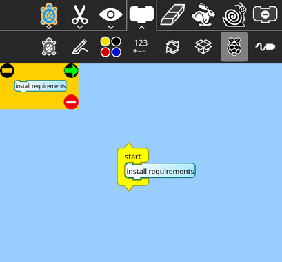
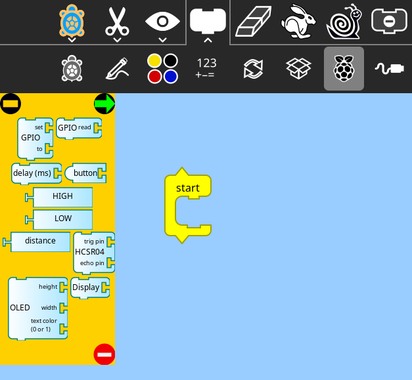
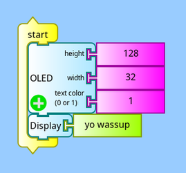
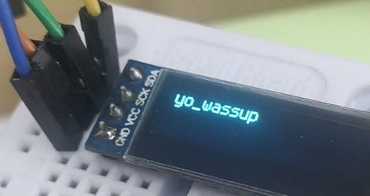
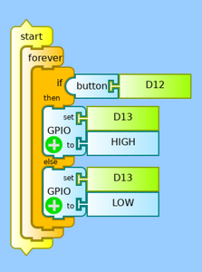
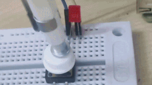

# RPi Plugin

This plugin will leverage the pins of Raspberry Pi to attach and control several peripherals to it. This plugin uses the *adafruit_blinka* library to communicate with sensors and components. Combining them with turtle blocks makes things as simple as they can get.

This plugin is compatible not only with Raspberry Pi but also with several other linux SBCs; OrangePi, BeagleBone, Google Coral Dev Boad, Jetson, Banana Pi, and NanoPi to name a few.

In Raspberry Pi, for using each component/sensor you will have to enter the pin number they are connected to with a 'D' in front of them. For example, **D7** for **GPIO 7** as you can see in the pinout diagram (standard for zero/3/4/5) below.\
Note that GPIO numbers and pin numbers (in the circle) are different. We need the GPIO numbers.


<br>

# Installation
Installation is pretty straightforward. Make sure you have an internet access.

    
- Install pip with `sudo apt install python3-pip`
- To install the dependencies for using RPi sensors:
    - Go to Raspberry Pi palette and simply run the **"install requirements"** block as shown in the image below. The requirements will start to download in the background.
    - After 1-2 minutes restart the TurtleArt Activity, all the blocks will be visible now

<br>

 &nbsp;&nbsp;&nbsp; 

<br>

# For developers
Improvements and additions are very much welcomed.

Structure:

```
rpi
├── rpi.py          (contains blocks linked to functions)
├── functions.py    (contains all callable functions)
├── __init__.py     (checks if the device is RPi and installs requirements)
├── req.txt         (requirements file)
├── sensors
│   └── //scripts to run sensors//
└── //some other files//

```

<!-- ## Use sensors in your activities -->


## How to contribute
For adding more sensors/components you can add turtle blocks in `rpi.py`, their corresponding functions in `functions.py`, and add their requirements in the `req.txt` file.

The pallet is only visible if the device is Raspberry Pi, so don't forget to disable the check in `__init__.py` when running on a PC

## Dependencies
- pip
- pip packages
    - adafruit-blinka
    - adafruit-circuitpython-displayio-ssd1306
    - adafruit-circuitpython-ssd1306
    - adafruit-circuitpython-display-text
    - adafruit-circuitpython-hcsr04

<br>

# Screenshots

**Oled Display:**

 

**Push Button:**

 